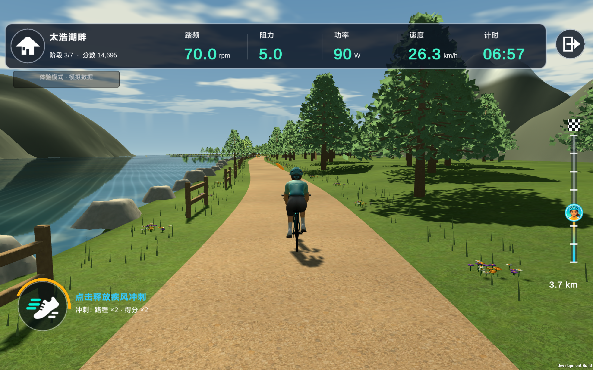
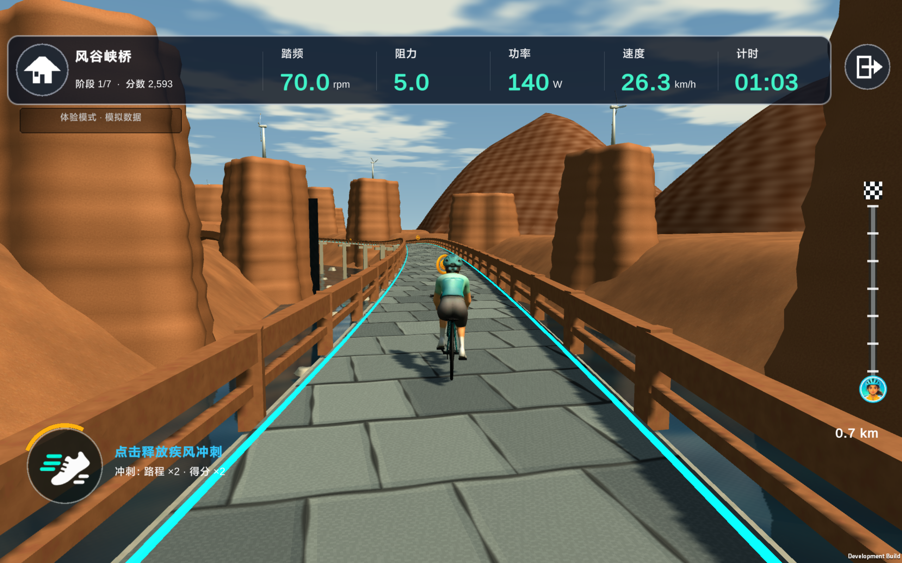
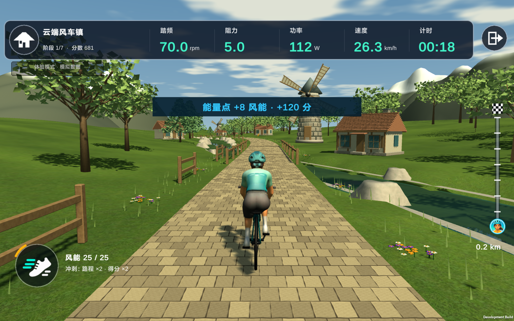

# Wind Trace Ride

**踩动单车，追随风，穿过湖畔、峡谷与风车小镇。**

Wind Trace Ride 是一款公开源码的室内骑行冒险游戏。连接蓝牙动感单车后，你的踏频会驱动角色踩踏与前进；在沿途收集风能、保持节奏、完成挑战，让每一次室内骑行都有一段可以抵达的旅程。

游戏基于 Unity 6，面向 Android 手机和平板的横屏体验。角色、自行车和场景美术使用 Blender 制作。公开仓库包含游戏源码与运行所需的导出模型、纹理等资源；Blender 原型、工程文件及内部制作资料保留私有。没有动感单车，也可以通过内置体验模式探索游戏。

**个人非商业使用免费；商业使用须事先取得项目权利人的书面授权。** 详细范围见[使用许可与来源](#使用许可与来源)。

## 游戏截图

以下为 Android 平板上运行开发版本时的游戏截图，使用体验模式的模拟骑行数据。画面展示开发过程中的版本，后续可能继续调整。

**太浩湖畔 · 湖岸与森林小径**



**风之峡谷 · 穿越峡谷风桥**



**云端风车镇 · 收集风能，骑过溪流小镇**



## 游戏特色

- **用真实踩踏驱动冒险**：踏频影响前进速度与角色动画，停止踩踏后暂停推进；设备断开或数据过期时也会暂停。
- **三种风景，三种骑行节奏**：从湖畔森林到峡谷风桥，再到溪流与风车环绕的小镇。
- **七阶段骑行课程**：热身、探索、踏频挑战、恢复、冲刺、关底挑战和放松，结合目标踏频与基于 FTP 的目标功率。
- **收集风能与加速**：沿途拾取风能，积攒能量并触发风能加速；保持目标节奏可获得连击与额外得分。
- **实时骑行信息**：显示踏频、阻力、功率、设备速度、骑行时间与路线进度，具体数据取决于设备提供的字段。
- **角色与语言选择**：支持男、女骑行角色，以及中文、英文界面；选择会保存在本机。
- **记住你的单车**：首次手动连接并保存设备，后续启动尝试重连该设备，也可以随时忘记并重新配对。
- **无需硬件即可体验**：内置模拟数据，方便预览关卡、开发和调试。

## 三段风之旅程

| 课程 | 场景 | 课程参考时长 | 游戏路线长度 |
| --- | --- | --- | --- |
| 太浩湖畔 / Tahoe Lakeside | 湖岸、森林小径与木屋 | 20 分钟 | 约 9.6 km |
| 风之峡谷 / Wind Canyon | 河谷、高架风桥与风力涡轮 | 30 分钟 | 约 14.4 km |
| 云端风车镇 / Cloud Village | 石铺小路、溪流与风车小镇 | 70 分钟 | 约 33.6 km |

时长是课程阶段的参考配置。停踩与暂停不计入有效骑行时间，实际到达终点的时间还会受踏频和风能加速影响。路线长度是游戏内距离，不等同于单车记录的里程。

湖畔路线参考了 OpenStreetMap 中太浩湖西岸的路线形状；当前地形与场景经过艺术化制作，不作为真实地形或道路的精确复现。

## 设备与平台

### 蓝牙协议

| 协议 / 设备 | 当前接入方式 |
| --- | --- |
| 标准 FTMS 室内单车 | 读取 Fitness Machine Service 的 Indoor Bike Data |
| YESOUL S1 旧协议 | 读取 YESOUL `0xFFF0` 服务的骑行数据 |

不同型号和固件提供的数据可能不同。实现了协议解析并不意味着所有同协议设备均已完成实机验证，欢迎反馈兼容情况。

目前游戏读取骑行数据，不自动调整设备阻力。YESOUL S1 的阻力由车上的机械旋钮手动调节。

### 平台状态

| 平台 | 当前状态 |
| --- | --- |
| Android 手机 / 平板 | 主要目标平台，已实现原生 BLE 接入与横屏游戏 |
| Unity Editor | 可通过模拟单车或体验模式运行 |
| Windows / iOS | 原生蓝牙接入尚未实现 |

## 快速开始

### 开发环境

- Unity Hub。
- **Unity 6 `6000.0.60f1`**，与 `ProjectSettings/ProjectVersion.txt` 一致。
- 构建 Android 时安装 **Android Build Support**，包括 SDK、NDK 和 OpenJDK。
- 游戏运行与构建使用项目内已有的导出资源，无需安装 Blender。

### 在编辑器中体验

1. 获取源码，在 Unity Hub 中添加仓库根目录，也就是包含 `Assets`、`Packages` 和 `ProjectSettings` 的目录。
2. 使用指定 Unity 版本打开项目，等待资源导入和脚本编译完成。
3. 打开 `Assets/Scenes/Bootstrap.unity`，点击 **Play**。
4. 在游戏设置中点击 **开启体验模式 · 模拟骑行**。
5. 回到主页，选择课程并进入关卡。

体验模式使用模拟踏频、阻力、功率和速度，不代表真实设备已经连接，也不会把模拟器保存为你的单车。

编辑器中还可以在设备设置里扫描并连接 **Wind Trace Simulator**，用于调试配对、数据解析与连接流程。

### 连接真实单车

1. 在 Android 设备上启动游戏，打开蓝牙并唤醒单车。
2. 进入游戏设置，点击 **扫描设备**，按提示授予蓝牙权限。
3. 找到自己的单车，点击 **连接并保存**。
4. 确认游戏收到骑行数据，返回主页并选择课程。
5. 开始踩踏，角色随踏频前进。

Android 12 及以上使用“附近的设备”权限；旧版本 Android 的蓝牙扫描需要定位权限。若无法连接，先确认单车没有被其他应用占用，随后重新扫描。

## 构建 Android

项目已经将 `Assets/Scenes/Bootstrap.unity` 加入构建场景。建议使用项目提供的构建入口，它会准备运行时材质并生成开发版 APK。

在仓库根目录运行以下 PowerShell 命令，将 Unity 路径改为你的实际安装位置：

```powershell
$unityEditor = 'C:\Program Files\Unity\Hub\Editor\6000.0.60f1\Editor\Unity.exe'
$projectRoot = (Get-Location).Path

& $unityEditor -batchmode -quit -projectPath $projectRoot `
  -buildTarget Android `
  -executeMethod WindTraceRide.Editor.AndroidBuild.BuildDevelopmentApk `
  -logFile android-build.log
```

默认输出为 `Builds/Android/WindTraceRide-dev.apk`。可用 `-buildOutput` 指定其他输出路径。运行批处理构建前，关闭正在打开同一项目的 Unity 编辑器。

该入口构建的是用于测试的开发版本；正式发行时需另行配置发布构建与签名。

## 项目结构

```text
Assets/
  Game/
    Core/               骑行会话、设备模型、协议解析与连接协调
    Devices/            Android BLE、模拟设备与本地设置
    Bootstrap/          游戏入口、界面、世界生成与角色动画
  Plugins/Android/      原生 Android 蓝牙库
  Resources/            模型、纹理、材质、音频与路线数据
  Shaders/              场景与水面等渲染效果
  Scenes/               Bootstrap 启动场景
  Editor/               构建、资源导入与视觉验证工具
  Tests/EditMode/       协议、连接、骑行逻辑与场景回归测试
docs/screenshots/       README 使用的游戏实机截图
SourceData/FreeGeo/      路线参考数据与转换脚本
Packages/               Unity 包依赖
ProjectSettings/        Unity 项目配置
```

蓝牙传输层接收设备广播、连接状态与原始数据包；核心层将其转换为统一的 `TrainerTelemetry`，供骑行逻辑与游戏表现使用。新增设备接入应优先沿用这一分层。

## 测试

在 Unity 中打开 **Window → General → Test Runner**，选择 **EditMode**，运行测试。

测试覆盖 FTMS 与 YESOUL 数据解析、设备连接与重连、停踩与恢复、课程阶段、风能加速、角色运动，以及场景分块和模型摆放。蓝牙实机兼容和长时间骑行性能仍需在真实设备上验证。

## 参与贡献

欢迎通过 Issue 反馈问题，通过 Pull Request 提交改进。当前尤其欢迎：

- 新设备与固件的兼容测试。
- Android 性能、内存与长时间运行优化。
- 场景、角色动画与课程体验改进。
- 翻译、文档与测试补充。

报告蓝牙问题时，请提供设备型号、固件版本（如已知）、Android 版本、复现步骤及相关日志。报告画面或性能问题时，请附上设备型号、课程与发生位置。

提交代码时，请保留 Unity `.meta` 文件；涉及协议或骑行逻辑的修改应补充对应测试。较大的玩法或架构调整，建议先通过 Issue 讨论。

## 使用许可与来源

本项目采用“个人非商业使用免费，商业使用另行授权”的使用许可，完整条款见 [LICENSE](LICENSE)。

- **个人非商业使用**：允许个人免费体验游戏、阅读源码、学习、编译，以及为自己的非商业用途修改项目。请保留原有版权与来源说明。
- **商业使用**：销售游戏或修改版本、作为付费健身服务的一部分、集成到商业设备或产品，以及其他以盈利或商业运营为目的的使用，均须事先取得项目权利人的书面授权。个人以盈利为目的的使用同样属于商业使用。
- **申请商业授权**：请通过本仓库的 Issue 联系项目维护者，说明使用场景、发行方式与预计规模；授权范围及条件以双方的书面约定为准。

本项目以公开源码的方式分享。由于商业使用需要另行授权，该许可不采用 Apache-2.0，也不属于 OSI 定义的开源许可证。

上述条款适用于本项目中由项目权利人拥有版权、且未另行标注许可的原创代码与美术素材。第三方组件、音乐、地理数据，以及已有独立许可声明的文件，仍遵循各自的许可证。

游戏角色、自行车与场景美术使用 Blender 制作。公开的美术资源为游戏运行所需的导出文件，适用上述个人非商业使用与商业授权条款；Blender 原型、源工程及内部制作工具不随公开仓库发布。

音乐与地理参考数据保留各自的许可和来源说明：

- [关卡音乐来源与 CC0 许可说明](Assets/Resources/Audio/Music/SOURCES.md)。
- OpenStreetMap 路线数据使用 [ODbL](https://www.openstreetmap.org/copyright)，署名为 © OpenStreetMap contributors。
- `SourceData/FreeGeo` 中保留了 USGS 3DEP 高程参考数据与旧的转换流程；当前艺术化场景不宣称精确还原该高程数据。
